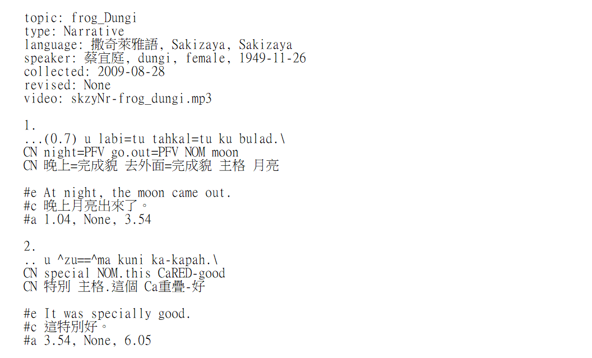

# **Glossing Tools for Txt Files**
Adding an additional interlinear gloss (i.e. gloss preamble) to a txt file or replacing items from the file.

<!-- 
 from glosstools import GlossReplacer, GlossAdder, GlossReader
import glob
from concurrent.futures import ThreadPoolExecutor

def write(file_name):
    return GlossAdder(file_name).add()

lst_txt = glob.glob('*.txt') 

with ThreadPoolExecutor() as executor:
    executor.map(write, lst_txt)
-->
